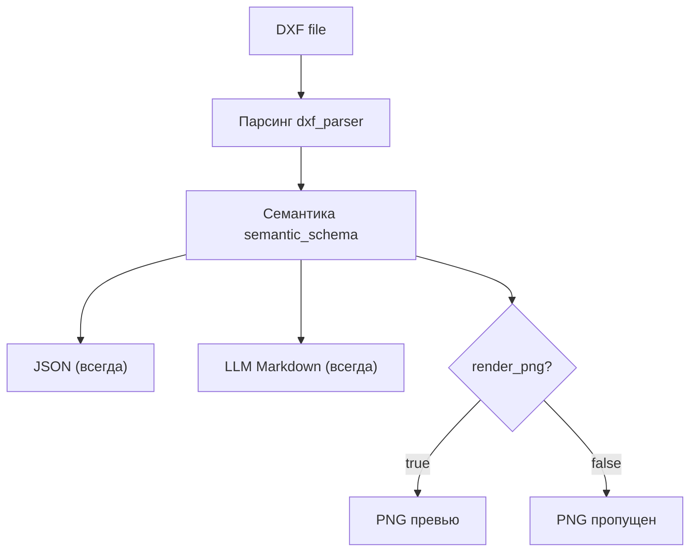
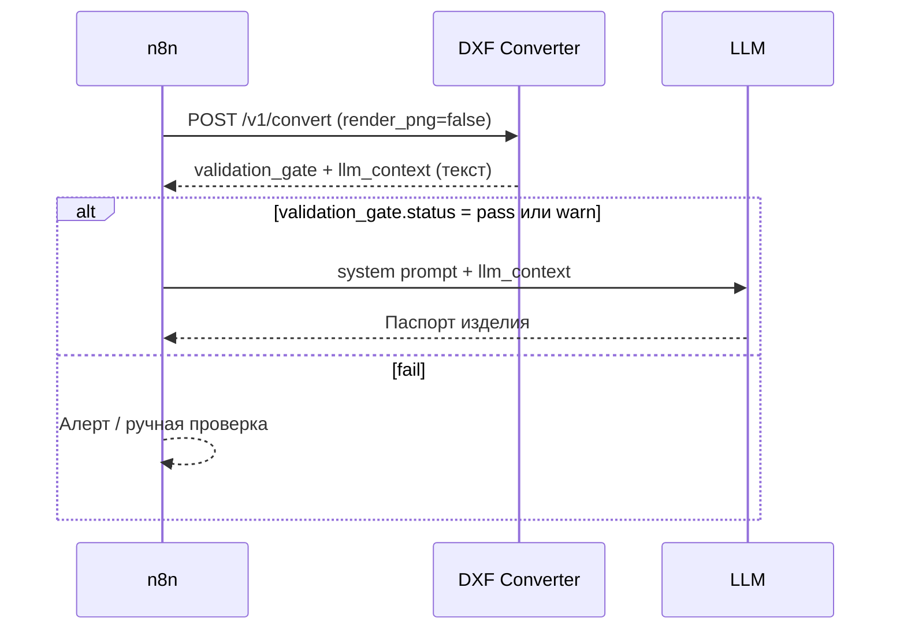

# DXF Converter — REST API

Базовый URL (локально): `http://localhost:8000`  
Интерактивная схема: `/docs` (Swagger), `/redoc` (ReDoc).

---

## Обзор эндпоинтов

| Метод | Путь | Назначение |
|-------|------|------------|
| `GET` | `/health` | Проверка живости сервиса |
| `POST` | `/v1/convert` | Конвертация DXF → артефакты (см. ветки ниже) |
| `GET` | `/v1/jobs/{job_id}` | Список файлов задачи |
| `GET` | `/v1/artifacts/{job_id}/{filename}` | Скачивание файла результата |

---

## Пайплайн конвертации: три ветки

Один вызов `POST /v1/convert` запускает общий парсинг DXF, затем формирует **до трёх артефактов**:



| Ветка | Артефакт | Когда создаётся | Для кого |
|-------|----------|-----------------|----------|
| **JSON** | `{name}.json` | **Всегда** | Аудит, интеграции, полные факты чертежа |
| **LLM Markdown** | поле `llm_context` в ответе API | **Всегда** | n8n / Gemini / Qwen — генерация паспорта |
| **PNG** | `{name}.png` | Если `render_png=true` (по умолчанию) | Превью, vision-модели, вложения в отчёты |

> **Важно:** ветки JSON и LLM Markdown **не зависят** от PNG.  
> PNG — отдельный рендер через `ezdxf` / LibreCAD; на содержимое Markdown он не влияет.

---

## Ветка 1 — Normalized JSON (база)

**Модуль:** `dxf_parser` → `semantic_schema`  
**Файл:** `{name}.json`  
**Размер:** от сотен KB до нескольких MB (зависит от сложности DXF).

### Что внутри

| Раздел JSON | Содержание |
|-------------|------------|
| `source` | Имя файла, checksum, mime-type |
| `drawing_facts` | Геометрия, `raw_entities`, размерные сущности, тексты, слои |
| `semantic_candidates` | Классифицированные факты: контур, отверстия, паз, ГДТ |
| `semantic_candidates.engineering_features` | Структурированная инженерная выжимка |
| `semantic_candidates.validation_gate` | `pass` / `warn` — готовность для LLM |
| `evidence` | Ссылки на источники фактов в чертеже |

### Когда нужен JSON

- Отладка парсера и семантики  
- Хранение полного снимка чертежа  
- Собственные интеграции поверх `drawing_facts`  

### Когда **не** нужен JSON в n8n

Для генерации паспорта через LLM достаточно ветки **LLM Markdown** — она ~100 строк вместо мегабайт JSON.

---

## Ветка 2 — LLM Engineering Context (Markdown)

**Модуль:** `markdown_context` (сжатие normalized JSON)  
**Формат выдачи:** строка **`llm_context`** в JSON-ответе `POST /v1/convert` (отдельный `.md` файл **не создаётся**)  
**Размер:** обычно **5–15 KB**, ~100–150 строк.

### Структура текста `llm_context`

| Секция Markdown | Назначение |
|-----------------|------------|
| `Source` | Имя DXF, единицы (mm) |
| `Product Identity` | **`part_type`** (тип детали), обозначение, габариты, материал |
| `Validation Gate` | `status`, `ready_for_llm`, warnings/errors |
| `Required Interpretation Rules` | Правила для LLM (не путать Ø45 с Ø11 и т.д.) |
| `Overall` | Габариты, таблица исполнений L |
| `External Contour` | Наружный диаметр, ступени, фаски |
| `Internal System` | Расточки, осевые отверстия |
| `Special Elements` | Группы отверстий, паз, канавки |
| `GDT` | Допуски формы и расположения |
| `Technical Requirements` | Ra, H14, маркировка, твердость |
| `Explicit Dimension Tokens` | Все извлечённые размерные токены из DXF |
| `Output Task For LLM` | Инструкция сформировать паспорт |

### Правила для коллеги (LLM-ветка)

1. **В LLM передавать поле `llm_context` из ответа API**, не полный JSON.  
2. **Тип детали** — из `part_type` внутри `llm_context` (секция Product Identity), не из обозначения.  
3. Проверять `validation_gate` в ответе API **до** вызова LLM:

| `validation_gate.status` | Действие |
|--------------------------|----------|
| `pass` | Можно генерировать паспорт |
| `warn` | Генерировать осторожно; не выдумывать размеры из `critical_unclassified` |
| `fail` | Остановить пайплайн, запросить ручную проверку |

3. При `warn` в системном промпте указать:  
   *«Используй только факты из Markdown. Сомнительные размеры формулируй как „требует проверки по чертежу“.»*

### Получить LLM-контекст (без PNG)

```bash
curl -s -X POST "http://localhost:8000/v1/convert" \
  -F "file=@samples/42-2 - Штифтодержатель.dxf" \
  -F "name=42-2" \
  -F "render_png=false" \
  | jq -r '.llm_context'
```

Markdown сразу в поле **`llm_context`** — второй HTTP-запрос не нужен.

### n8n — ветка «только паспорт»



**Ноды n8n:**

1. **HTTP Request** — `POST /v1/convert`, Body: Form-Data, поле `file`  
2. **IF** — `{{ $json.validation_gate.status }}` ≠ `fail`  
3. **LLM** — System prompt + `{{ $json.llm_context }}`  

---

## Ветка 3 — PNG превью

**Модуль:** `rendering` (`ezdxf` matplotlib backend по умолчанию)  
**Файл:** `{name}.png`  
**Создаётся:** только при `render_png=true`.

### Параметры рендера

| Поле формы | По умолчанию | Описание |
|------------|--------------|----------|
| `render_png` | `true` | Включить/выключить ветку PNG |
| `png_dpi` | `300` | Разрешение (72–1200). Выше = детальнее, но тяжелее |
| `dxf_text_policy` | `filling` | Как рисовать текст: `filling`, `outline`, `replace_rect`, `replace_fill`, `ignore` |
| `dxf_lineweight_scaling` | `1.0` | Масштаб толщин линий |
| `dxf_text_scale` | `1.0` | Масштаб размера текста (напр. `0.9` при наложениях) |
| `dxf_letter_spacing` | `1.0` | Межсимвольный интервал (напр. `1.08`) |
| `dxf_render_backend` | `classic` | `classic` (ezdxf), `librecad`, `auto` |

### Рекомендации по PNG

| Сценарий | Настройки |
|----------|-----------|
| Стандартное превью | `png_dpi=300`, `dxf_text_policy=filling` |
| Мелкий текст наезжает | `dxf_text_scale=0.9`, `dxf_letter_spacing=1.08` |
| Быстрая конвертация без картинки | `render_png=false` |
| Максимальная детализация | `png_dpi=400`–`600` |

---

## `GET /health`

**Ответ 200**

```json
{
  "status": "ok",
  "service": "dxf-converter"
}
```

Используйте для healthcheck в Docker/Kubernetes.

---

## `POST /v1/convert`

Загрузка одного файла `.dxf`, синхронная конвертация всех веток.

**Content-Type:** `multipart/form-data`

### Все поля формы

| Поле | Тип | Обязательно | По умолчанию | Ветка | Описание |
|------|-----|-------------|--------------|-------|----------|
| `file` | file | да | — | все | Файл `.dxf` |
| `name` | string | нет | имя файла | все | Базовое имя: `42-2` → `42-2.json`, `42-2.png` |
| `part_type` | string | нет | — | LLM | Явный тип детали, если имя файла при загрузке потеряно (`Компенсатор`) |
| `render_png` | bool | нет | `true` | PNG | `false` — только JSON + LLM Markdown |
| `png_dpi` | int | нет | `300` | PNG | DPI превью (72–1200) |
| `dxf_text_policy` | string | нет | `filling` | PNG | Режим отрисовки текста |
| `dxf_lineweight_scaling` | float | нет | `1.0` | PNG | Масштаб толщин линий |
| `dxf_text_scale` | float | нет | `1.0` | PNG | Масштаб текста |
| `dxf_letter_spacing` | float | нет | `1.0` | PNG | Межсимвольный интервал |
| `dxf_render_backend` | string | нет | `classic` | PNG | `classic`, `librecad`, `auto` |

### Ответ 200

```json
{
  "job_id": "a1b2c3d4e5f6...",
  "name": "42-2",
  "source_file": "42-2 - Штифтодержатель.dxf",
  "designation": "42-2",
  "product_name": "Штифтодержатель",
  "part_type": "Штифтодержатель",
  "validation_gate": {
    "status": "pass",
    "ready_for_llm": true,
    "errors": [],
    "warnings": []
  },
  "llm_context": "# LLM Engineering Context\n\nЭтот Markdown является компактной инженерной выжимкой...",
  "files": {
    "json": "42-2.json",
    "png": "42-2.png"
  },
  "download_urls": {
    "json": "http://localhost:8000/v1/artifacts/a1b2.../42-2.json",
    "png": "http://localhost:8000/v1/artifacts/a1b2.../42-2.png"
  }
}
```

При `render_png=false` ключ `png` **отсутствует** в `files` и `download_urls`.

### Ошибки

| Код | Причина |
|-----|---------|
| `400` | Не `.dxf` или неверное имя файла при скачивании |
| `404` | Задача/файл не найден |
| `422` | Ошибка парсинга или рендера DXF |

### Примеры `curl`

**Полный пайплайн (JSON + LLM + PNG):**

```bash
curl -X POST "http://localhost:8000/v1/convert" \
  -F "file=@samples/42-2 - Штифтодержатель.dxf" \
  -F "name=42-2" \
  -F "png_dpi=300"
```

**Только JSON + LLM Markdown (быстрее):**

```bash
curl -X POST "http://localhost:8000/v1/convert" \
  -F "file=@samples/42-2 - Штифтодержатель.dxf" \
  -F "name=42-2" \
  -F "render_png=false"
```

**Скачать файловые артефакты (JSON / PNG):**

```bash
curl -o 42-2.png  "http://localhost:8000/v1/artifacts/JOB_ID/42-2.png"
curl -o 42-2.json "http://localhost:8000/v1/artifacts/JOB_ID/42-2.json"
```

---

## `GET /v1/jobs/{job_id}`

Список артефактов задачи (после конвертации).

**Ответ 200**

```json
{
  "job_id": "a1b2c3d4...",
  "artifacts": [
    {
      "name": "42-2.json",
      "size_bytes": 1716505,
      "url": "http://localhost:8000/v1/artifacts/a1b2.../42-2.json"
    },
    {
      "name": "42-2.png",
      "size_bytes": 354649,
      "url": "http://localhost:8000/v1/artifacts/a1b2.../42-2.png"
    }
  ]
}
```

---

## `GET /v1/artifacts/{job_id}/{filename}`

Скачивание конкретного файла результата.

| Файл | Ветка | Content-Type |
|------|-------|--------------|
| `42-2.png` | PNG | `image/png` |
| `42-2.json` | JSON | `application/json` |

> LLM Markdown — только в поле **`llm_context`** ответа `POST /v1/convert`, не как файл.

---

## Шпаргалка для коллеги

| Задача | Что запрашивать | Что брать из ответа |
|--------|-----------------|---------------------|
| Паспорт через LLM | `POST /v1/convert` | поле `llm_context`, внутри — `part_type` |
| Превью чертежа | `POST /v1/convert` + `render_png=true` | `download_urls.png` |
| Аудит / отладка парсера | `POST /v1/convert` | `download_urls.json` |
| Быстро, без картинки | `render_png=false` | поле `llm_context` |
| Проверка перед LLM | `POST /v1/convert` | поле `validation_gate` |

---

## Переменные окружения

| Переменная | По умолчанию | Описание |
|------------|--------------|----------|
| `ARTIFACTS_DIR` | `data/artifacts` | Каталог хранения результатов |
| `CORS_ORIGINS` | `*` | CORS для фронта/n8n |
| `HOST` / `PORT` | — | Задаются при запуске (`main.py --serve`) |

---

## Источники `part_type` (тип детали)

| Приоритет | Источник | Пример |
|-----------|----------|--------|
| 1 | **Штамп DXF** (основная надпись) | блок `U4`: `Компенсатор` |
| 2 | Поле формы `part_type` | ручной override через API |
| 3 | Имя файла | только fallback, если штамп не распознан |

Системный промпт для n8n: `docs/system_prompt_passport_markdown.md`

---

## Ограничения

- Вход только **DXF** (PDF/сканы не поддерживаются).  
- Конвертация **синхронная** — большие DXF могут обрабатываться десятки секунд.  
- **LLM Markdown не зависит от PNG** — отключение PNG не влияет на качество контекста.  
- Артефакты хранятся на диске сервиса; политику очистки `job_id` нужно настроить отдельно (cron / TTL).
