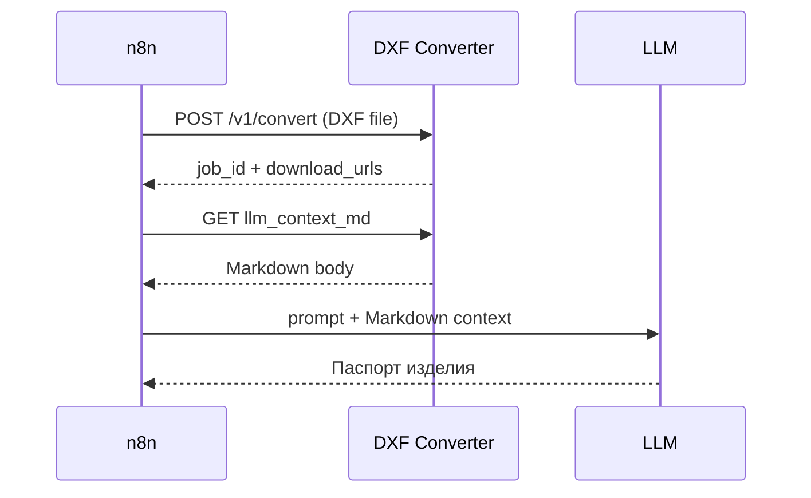

# DXF Converter — REST API

Базовый URL (локально): `http://localhost:8000`  
Интерактивная схема: `/docs` (Swagger), `/redoc` (ReDoc).

---

## Обзор

| Метод | Путь | Назначение |
|-------|------|------------|
| `GET` | `/health` | Проверка живости сервиса |
| `POST` | `/v1/convert` | Конвертация DXF → PNG + JSON + LLM Markdown |
| `GET` | `/v1/jobs/{job_id}` | Список файлов задачи |
| `GET` | `/v1/artifacts/{job_id}/{filename}` | Скачивание файла результата |

---

## `GET /health`

**Ответ 200**

```json
{
  "status": "ok",
  "service": "dxf-converter"
}
```

Используйте для healthcheck в Docker/Kubernetes.

---

## `POST /v1/convert`

Загрузка одного файла `.dxf`, синхронная конвертация.

**Content-Type:** `multipart/form-data`

### Поля формы

| Поле | Тип | Обязательно | По умолчанию | Описание |
|------|-----|-------------|--------------|----------|
| `file` | file | да | — | Файл `.dxf` |
| `name` | string | нет | имя файла | Базовое имя артефактов (`42-2` → `42-2.json`, …) |
| `png_dpi` | int | нет | `300` | DPI превью (72–1200) |
| `render_png` | bool | нет | `true` | Рендерить PNG |
| `dxf_text_policy` | string | нет | `filling` | `filling`, `outline`, `replace_rect`, `replace_fill`, `ignore` |
| `dxf_lineweight_scaling` | float | нет | `1.0` | Масштаб толщин линий |
| `dxf_text_scale` | float | нет | `1.0` | Масштаб текста |
| `dxf_letter_spacing` | float | нет | `1.0` | Межсимвольный интервал |
| `dxf_render_backend` | string | нет | `classic` | `classic`, `librecad`, `auto` |

### Ответ 200

```json
{
  "job_id": "a1b2c3d4e5f6...",
  "name": "42-2",
  "source_file": "42-2 - Штифтодержатель.dxf",
  "designation": "42-2",
  "product_name": "Штифтодержатель",
  "validation_gate": {
    "status": "pass",
    "ready_for_llm": true,
    "errors": [],
    "warnings": []
  },
  "files": {
    "json": "42-2.json",
    "llm_context_md": "42-2_llm_context.md",
    "png": "42-2.png"
  },
  "download_urls": {
    "json": "http://localhost:8000/v1/artifacts/a1b2.../42-2.json",
    "llm_context_md": "http://localhost:8000/v1/artifacts/a1b2.../42-2_llm_context.md",
    "png": "http://localhost:8000/v1/artifacts/a1b2.../42-2.png"
  }
}
```

### Ошибки

| Код | Причина |
|-----|---------|
| `400` | Не `.dxf` или неверное имя файла при скачивании |
| `404` | Задача/файл не найден |
| `422` | Ошибка парсинга или рендера DXF |

### Пример `curl`

```bash
curl -X POST "http://localhost:8000/v1/convert" \
  -F "file=@42-2 - Штифтодержатель.dxf" \
  -F "name=42-2" \
  -F "png_dpi=300"
```

Скачать LLM-контекст:

```bash
curl -o 42-2_llm_context.md "http://localhost:8000/v1/artifacts/JOB_ID/42-2_llm_context.md"
```

---

## `GET /v1/jobs/{job_id}`

Список артефактов задачи (после конвертации).

**Ответ 200**

```json
{
  "job_id": "a1b2c3d4...",
  "artifacts": [
    {
      "name": "42-2.json",
      "size_bytes": 3456789,
      "url": "http://localhost:8000/v1/artifacts/a1b2.../42-2.json"
    },
    {
      "name": "42-2_llm_context.md",
      "size_bytes": 7123,
      "url": "http://localhost:8000/v1/artifacts/a1b2.../42-2_llm_context.md"
    }
  ]
}
```

---

## `GET /v1/artifacts/{job_id}/{filename}`

Скачивание конкретного файла результата.

**Примеры:**

- `.../42-2.png` — превью  
- `.../42-2.json` — normalized JSON  
- `.../42-2_llm_context.md` — контекст для LLM  

---

## Сценарий для n8n



1. **HTTP Request** → `POST /v1/convert`, body: form-data, поле `file`.  
2. Из ответа взять `download_urls.llm_context_md` (или `files` + `job_id`).  
3. **HTTP Request** → GET Markdown.  
4. Передать текст в LLM-ноду вместе с системным промптом паспорта.  

При `validation_gate.status = warn` — в промпте указать: не выдумывать размеры из `critical_unclassified`.

---

## Переменные окружения

| Переменная | По умолчанию | Описание |
|------------|--------------|----------|
| `ARTIFACTS_DIR` | `data/artifacts` | Каталог хранения результатов |
| `CORS_ORIGINS` | `*` | CORS для фронта/n8n |
| `HOST` / `PORT` | — | Задаются при запуске (`main.py --serve`) |

---

## Ограничения

- Вход только **DXF** (PDF/сканы не поддерживаются этим сервисом).  
- Конвертация **синхронная** — большие DXF могут обрабатываться десятки секунд; для продакшена позже можно вынести в очередь.  
- Артефакты хранятся на диске сервиса; политику очистки `job_id` нужно настроить отдельно (cron / TTL).
